# Ejecutar Gestor de FIP — Guía para administradores y facilitadores

**Gestor de FIP** es una herramienta pequeña y autoalojada para crear, comparar y exportar
[GO FAIR](https://www.gofair.foundation/) **Perfiles de Implementación FAIR (FIP)**. Está diseñada
para ser utilizada por una persona para una comunidad o un evento: un facilitador abre una sesión,
los participantes rellenan perfiles en sus teléfonos, y la sala compara los resultados lado a lado
y los exporta como JSON, CSV y RDF.

Esta guía es para la persona que **ejecuta una instancia** — implementándola, preparando los
cuestionarios, facilitando sesiones, administrando usuarios y operándola después. Para las
personas que rellenan los formularios, consulte la
[Guía para participantes](participant-guide.es.md); para el guion del taller CONFOA de 30 minutos, consulte
[`workshop/facilitator-script.md`](workshop/facilitator-script.md).

> **Escala y forma.** El stack es FastAPI + SQLAlchemy + SQLite y Vue 3 + Vite. Está diseñado para
> ejecutarse desde un solo contenedor, sobrevivir a la red de una conferencia, y funcionar sin conexión
> desde un portátil y un punto de acceso si la Wi-Fi del lugar falla.

---

## Tabla de contenidos

1. [Las piezas y cómo encajan](#1-las-piezas-y-cómo-encajan)
2. [Quién puede hacer qué](#2-quién-puede-hacer-qué)
3. [Implementar una instancia](#3-implementar-una-instancia)
4. [Referencia de configuración](#4-referencia-de-configuración)
5. [Preparar el cuestionario (modelos de conocimiento)](#5-preparar-el-cuestionario-modelos-de-conocimiento)
6. [Importar cuestionarios por área desde un documento](#6-importar-cuestionarios-por-área-desde-un-documento)
7. [Ejecutar una sesión](#7-ejecutar-una-sesión)
8. [Comparar los resultados](#8-comparar-los-resultados)
9. [El catálogo FER](#9-el-catálogo-fer)
10. [Administración de usuarios](#10-administración-de-usuarios)
11. [Exportaciones y RDF](#11-exportaciones-y-rdf)
12. [Mover FIP a una nueva versión de cuestionario](#12-mover-fip-a-una-nueva-versión-de-cuestionario)
13. [El panel](#13-el-panel)
14. [La red de nanopublicaciones](#14-la-red-de-nanopublicaciones)
15. [Operar la instancia](#15-operar-la-instancia)
16. [Referencia de línea de comandos](#16-referencia-de-línea-de-comandos)
17. [Solución de problemas](#17-solución-de-problemas)

---

## 1. Las piezas y cómo encajan

| Término | Qué es |
|---|---|
| **Modelo de conocimiento** | El cuestionario en sí — secciones, preguntas, textos de ayuda, opciones sugeridas, en cada idioma. Con versión, y puede ser un **borrador** (editable) o **publicado** (inmutable). |
| **Versión** | Un modelo de conocimiento publicado es inmutable. Los cambios van a una nueva versión; los FIP existentes permanecen en la versión contra la que se rellenaron hasta que se migran. |
| **FER** (FAIR Enabling Resource) | Una tecnología, servicio o estándar con nombre que se puede dar como respuesta. Existe en el **catálogo del sistema** (global) o **integrado** en un modelo de conocimiento. |
| **Sesión** | Un ejercicio facilitado: un código de acceso, uno o más cuestionarios, y los FIP producidos en él. |
| **Área** | Uno de varios cuestionarios ofrecidos por una sola sesión, para que los participantes elijan el que se ajusta a su campo. |
| **FIP** | Las respuestas de una comunidad. Pertenece a una sesión, al espacio de trabajo de un usuario, o a ninguno (independiente). |
| **Población** | Un concepto del panel: el conjunto de FIP sobre el que se ejecuta un análisis — una sesión, los FIP públicos de esta instancia, o FIP ingeridos desde la red. |

El contenido es **datos, no código**: los cuestionarios, el catálogo FER y las traducciones son JSON
bajo `data/`. Cambiar las preguntas nunca requiere un cambio de código ni un redepliegue de la
imagen de la aplicación.

---

## 2. Quién puede hacer qué

| Rol | Puede |
|---|---|
| **Visitante anónimo** | Unirse a una sesión y rellenar un FIP; crear un FIP independiente; navegar por los modelos de conocimiento públicos y los FIP públicos; leer el cuestionario impreso |
| **Usuario registrado** | Todo lo anterior, más un espacio de trabajo propio con sus FIP, sesiones y modelos; reclamar FIP anónimos; establecer la visibilidad de FIP; crear y ejecutar sesiones; bifurcar y publicar modelos de conocimiento |
| **Administrador** | Todo lo anterior, más la página de administración: listar y buscar usuarios, emitir contraseñas temporales, promover y fusionar FER pendientes, y editar borradores de modelos de conocimiento sin dueño |

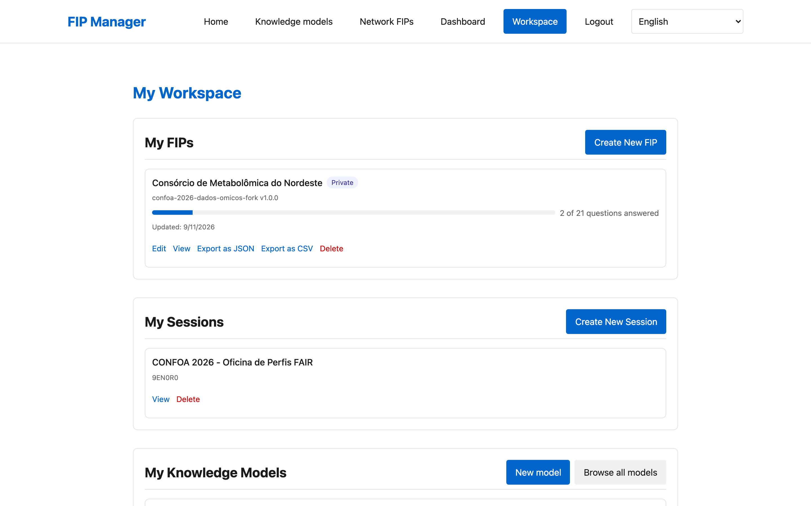

No existe un rol separado de "facilitador": **cualquier usuario registrado puede ejecutar una sesión**.
La facilitación es algo que se hace, no un permiso que se otorga.

---

## 3. Implementar una instancia

### El camino rápido

```sh
docker compose up --build
```

### Ejecutarlo directamente

Backend (Python 3.12, [uv](https://docs.astral.sh/uv/)):

```sh
cd backend
uv sync
cp ../.env.example ../.env    # luego edítelo — vea §4
uv run python -m fipm import-data
uv run python -m fipm serve   # http://localhost:8000
```

Frontend (Node 20):

```sh
cd frontend && npm install && npm run dev
```

`FIPM_DB_PATH` y `FIPM_DATA_DIR` por defecto son `<repo-root>/fipm.db` y `<repo-root>/data`,
resueltos desde la ubicación del propio módulo de configuración en lugar del directorio de trabajo,
por lo que `import-data` y `serve` encuentran el directorio real `data/` ya sea que los ejecute desde
la raíz del repositorio o desde `backend/`.

### Antes de dejar entrar a nadie

- [ ] **Establezca `FIPM_SECRET_KEY`** con un valor aleatorio real. El valor por defecto es `dev-secret-change-me`
      y establecer `FIPM_ENV=production` rechaza iniciar con secretos de desarrollo en su lugar.
- [ ] **Establezca `FIPM_BASE_URL`** con la URL pública HTTPS. Se usa para construir enlaces de acceso, códigos QR
y identificadores de FIP — vea la advertencia a continuación.
- [ ] **Sirva a través de HTTPS** y deje `FIPM_COOKIE_SECURE=true`.
- [ ] **Cree el usuario administrador**: `uv run python -m fipm create-admin --email you@example.org --password '…'`
- [ ] **Cargue el contenido**: `uv run python -m fipm import-data`
- [ ] **Establezca `FIPM_CONTACT_EMAIL` y `FIPM_HOSTING_ORG`** — aparecen en el aviso de privacidad,
      que es una promesa que hace a los participantes.
- [ ] **Si está detrás de un proxy inverso**, establezca `FIPM_TRUST_PROXY=true` solo una vez que haya verificado que
      el proxy realmente establece `X-Forwarded-For`. Confiar en ello de otra manera permite a los clientes
      falsificar su IP y burlar el límite de velocidad.

> **`FIPM_BASE_URL` sobrevive al nombre de host.** Los identificadores de FIP se construyen a partir de él, por lo que
> mover la instancia a un dominio diferente más adelante cambia la identidad de cada FIP ya creado.
> Decida la URL pública permanente *antes* de que exista el primer FIP real, no después.

---

## 4. Referencia de configuración

Todas las configuraciones son variables de entorno con prefijo `FIPM_`, leídas por `backend/fipm/config.py`;
vea `.env.example` para la lista definitiva.

### Identidad y seguridad

| Configuración | Valor por defecto | Controla |
|---|---|---|
| `FIPM_BASE_URL` | `http://localhost:8000` | URL pública; enlaces de acceso, códigos QR, identificadores de FIP |
| `FIPM_SECRET_KEY` | `dev-secret-change-me` | Firma de sesión — **debe** cambiarse |
| `FIPM_ENV` | `development` | `production` rechaza secretos de desarrollo |
| `FIPM_COOKIE_SECURE` | `true` | Requiere HTTPS para cookies de sesión |
| `FIPM_ALLOWED_ORIGINS` | *(vacío)* | Lista de permitidos CORS |
| `FIPM_TRUST_PROXY` | `false` | Confiar en `X-Forwarded-For` — solo detrás de un proxy verificado |
| `FIPM_MAX_BODY_BYTES` | 2 MiB | Límite de tamaño de cuerpo de solicitud |
| `FIPM_SESSION_TTL_DAYS` | `14` | Expiración de sesión facilitada |

### Almacenamiento y contenido

| Configuración | Valor por defecto | Controla |
|---|---|---|
| `FIPM_DB_PATH` | `./fipm.db` | Archivo SQLite |
| `FIPM_DATA_DIR` | `./data` | Modelos de conocimiento y catálogo FER |
| `FIPM_STATIC_DIR` | `./frontend/dist` | Frontend compilado |
| `FIPM_DEFAULT_LANGUAGE` | `en` | Idioma de reserva |
| `FIPM_ID_PREFIX` | *(vacío)* | Prefijo para ID generados |

### Qué puede hacer cada quien

| Configuración | Valor por defecto | Controla |
|---|---|---|
| `FIPM_REGISTRATION_OPEN` | `true` | Si cualquiera puede crear una cuenta |
| `FIPM_ANONYMOUS_FIPS` | `true` | Si los FIP pueden crearse sin sesión ni cuenta |
| `FIPM_REQUIRE_EMAIL_VERIFICATION` | `false` | Puerta de verificación de correo — **desactivada** para el taller |
| `FIPM_FEEDBACK_ENABLED` | `true` | El formulario de retroalimentación |

### Aviso de privacidad

| Configuración | Valor por defecto | Controla |
|---|---|---|
| `FIPM_CONTACT_EMAIL` | `contact@example.org` | Mostrado en `/privacy` |
| `FIPM_HOSTING_ORG` | `the FIP Manager operators` | Mostrado en `/privacy` |

### Correo

`FIPM_MAIL_BACKEND` por defecto es `console` (los mensajes se registran, no se envían). Para correo real
establézcalo a `smtp` y configure `FIPM_MAIL_FROM`, `FIPM_SMTP_HOST`, `FIPM_SMTP_PORT`,
`FIPM_SMTP_USER`, `FIPM_SMTP_PASSWORD`, `FIPM_SMTP_TLS`. Los tiempos de vida de los tokens son
`FIPM_MAIL_TOKEN_TTL_HOURS` (24) y `FIPM_RESET_TOKEN_TTL_HOURS` (1).

### Integración y red

| Configuración | Valor por defecto | Controla |
|---|---|---|
| `FIPM_FIODMP_BASE_URL` | `https://fiodmp.fiocruz.br` | Vinculación DMP |
| `FIPM_EMBED_ALLOWED_ORIGINS` | `https://fiodmp.fiocruz.br` | `frame-ancestors` para la vista de incrustación |
| `FIPM_NETWORK_ENABLED` | `true` | Puntos finales de la red de nanopublicaciones |
| `FIPM_NANOPUB_QUERY_URL` | `https://query.knowledgepixels.com` | Servicio de consulta de la red |
| `FIPM_NETWORK_TIMEOUT_SECONDS` | `10.0` | Tiempo de espera por solicitud |
| `FIPM_NETWORK_CACHE_TTL_SECONDS` | `900` | Caché de respuestas |
| `FIPM_NETWORK_MAX_RESPONSE_BYTES` | 8 MiB | Límite de respuesta ascendente |

### Panel

El panel tiene una gran cantidad de configuraciones de ajuste; las que vale la pena conocer son:

| Configuración | Valor por defecto | Controla |
|---|---|---|
| `FIPM_DASHBOARD_ENABLED` | `true` | Desactiva todo el panel |
| `FIPM_DASHBOARD_MIN_POPULATION` | `5` | Límite de k-anonimato — los recuentos se retienen por debajo de este cuando la población contiene FIP que el espectador no puede abrir |
| `FIPM_DASHBOARD_DEFAULT_WEIGHTING` | `principle` | Ponderación de similitud: `principle`, `question` o `letter` |
| `FIPM_DASHBOARD_CLUSTER_MIN_SIM` | `0.6` | Umbral de similitud para dibujar un borde de agrupación |
| `FIPM_DASHBOARD_SNAPSHOT_TTL_SECONDS` | `3600` | Cuánto tiempo permanece fresca una vista en caché |
| `FIPM_DASHBOARD_CSV_MAX_ROWS` | `100000` | Límite de filas en exportaciones CSV del panel |
| `FIPM_DASHBOARD_BACKFILL_ON_STARTUP` | `true` | Construye la proyección al iniciar para instancias pequeñas |

Las configuraciones restantes `FIPM_DASHBOARD_LSH_*`, `_POSTING_*` y `_MAX_CELLS` ajustan el índice de
similitud y los límites de niveles en vivo/instantánea. Déjelas así a menos que esté ejecutando decenas de
miles de FIP; `FIPM_DASHBOARD_LSH_BANDS × FIPM_DASHBOARD_LSH_ROWS` debe ser igual a
`FIPM_DASHBOARD_LSH_K`.

---

## 5. Preparar el cuestionario (modelos de conocimiento)

El editor de modelos de conocimiento está en su espacio de trabajo. Puede:

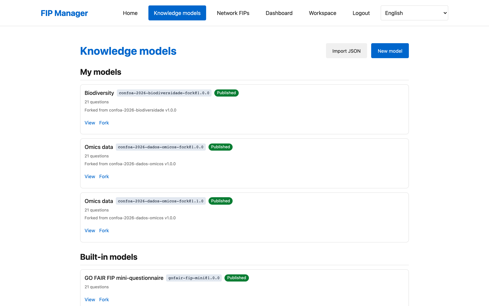

- **Bifurcar** un modelo existente — el punto de partida habitual. Obtiene un borrador editable.
- **Crear desde cero**, o **importar** un modelo exportado en otro lugar.

Dentro de un borrador que controla, por pregunta:

- **Texto y ayuda**, en cada idioma, en pestañas de idioma (en, pt-PT, pt-BR, es).
- **Tipo de FER** — qué tipo de recurso pregunta la pregunta. Esto es lo que hace que una respuesta
  sea verificable de tipo, así que configúrelo deliberadamente.
- **FER sugeridos** — recursos del catálogo ofrecidos como selecciones rápidas (como máximo 16 por pregunta).
- **Frases sugeridas** — redacciones de texto libre ofrecidas como selecciones rápidas, para prácticas que no son
  un producto con nombre (como máximo 12 por pregunta). Estas nunca entran al catálogo FER.
- **Permitir múltiples** declaraciones, y **permitir texto libre** (ambas activadas por defecto).
- **Declaraciones compactas** — colapsan el estado, la nota y el sustituto detrás de un interruptor "más". Esto
  es lo que mantiene el formulario utilizable en un teléfono; déjelo activado para modelos de taller.

Puede reordenar, ocultar, dividir y añadir preguntas, y el editor valida el modelo y lista los
errores antes de que publique.

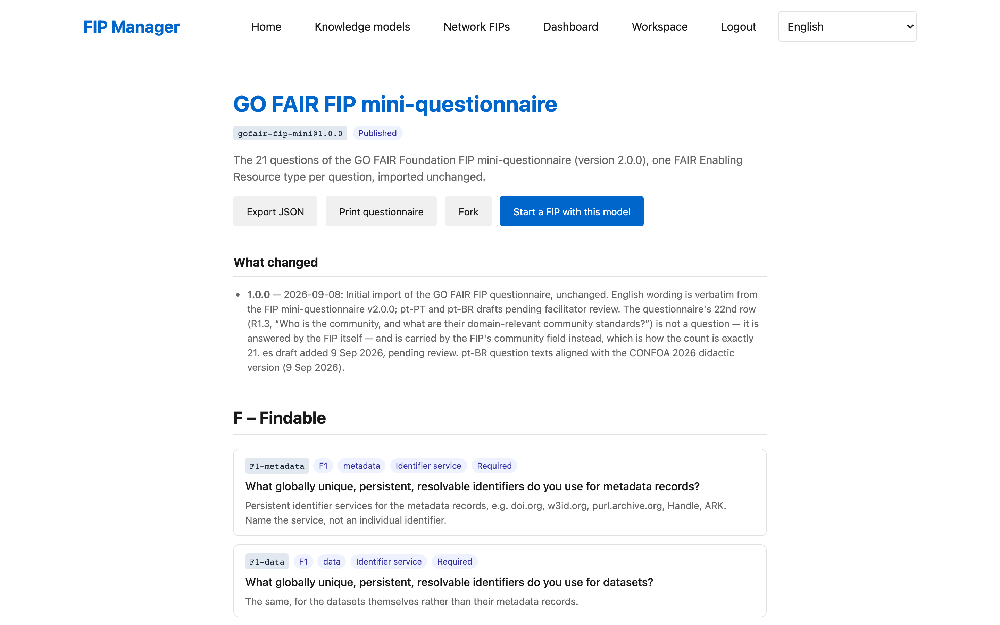

> **Publicar es en un solo sentido.** Una versión publicada es inmutable para que los FIP rellenados contra
> ella sigan siendo significativos. Las correcciones van a una nueva versión, con una entrada en el
> registro de cambios. Planee publicar *antes* del evento, no durante.

Orden de opciones como los participantes las ven: opciones del catálogo, luego frases sugeridas,
luego **"Otro (especificar)"**. 

---

## 6. Importar cuestionarios por área desde un documento

`scripts/import-workshop-docx.py` convierte un documento Word de listas de opciones por área en un
borrador de modelo de conocimiento por área:

```sh
uv run --project backend python scripts/import-workshop-docx.py \
    --docx "docs/workshop/PERFIS DE IMPLEMENTAÇÃO FAIR 2.docx" --bump --report -
```

Escribe borradores `confoa-2026-<área>-<versión>.json` más un informe de preguntas faltantes y
opciones no resueltas — **lea el informe**. Las opciones que nombran un recurso del catálogo se
convierten en FER sugeridos; las frases descriptivas se convierten en frases sugeridas; los
centinelas "Outros", "Não se aplica" y "Ainda não definido" son manejados por la interfaz en lugar de
convertirse en opciones.

Volver a ejecutar es seguro: un documento cambiado produce una nueva versión de borrador junto a
la antigua, nunca una sobrescritura. Use `--overwrite-draft` solo cuando deliberadamente quiera
reemplazar un borrador no publicado.

> **Los borradores no están activos hasta que un humano los publica.** Revise cada uno en el editor —
> especialmente las opciones con incompatibilidad de tipo que el informe marca — luego publique.

---

## 7. Ejecutar una sesión

**Cree** una sesión desde su espacio de trabajo: déle un título, elija **una o más** versiones de
cuestionario, opcionalmente etiquete cada una como un área, y establezca un idioma por defecto.

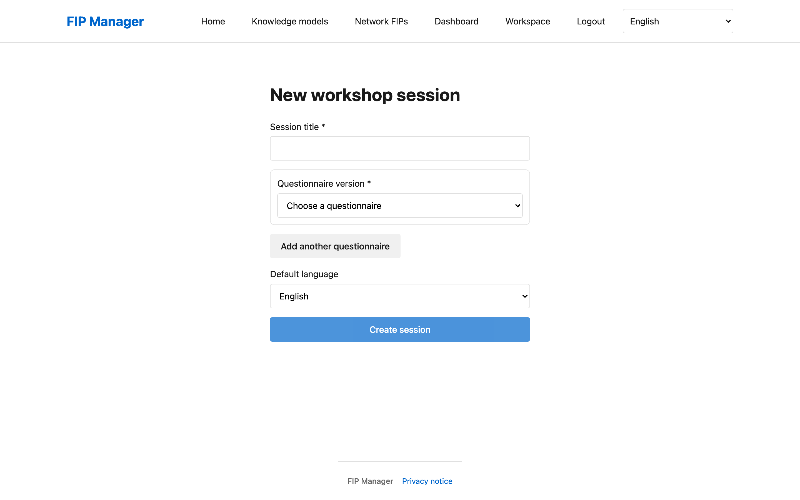

La página de la sesión es su consola durante el ejercicio:

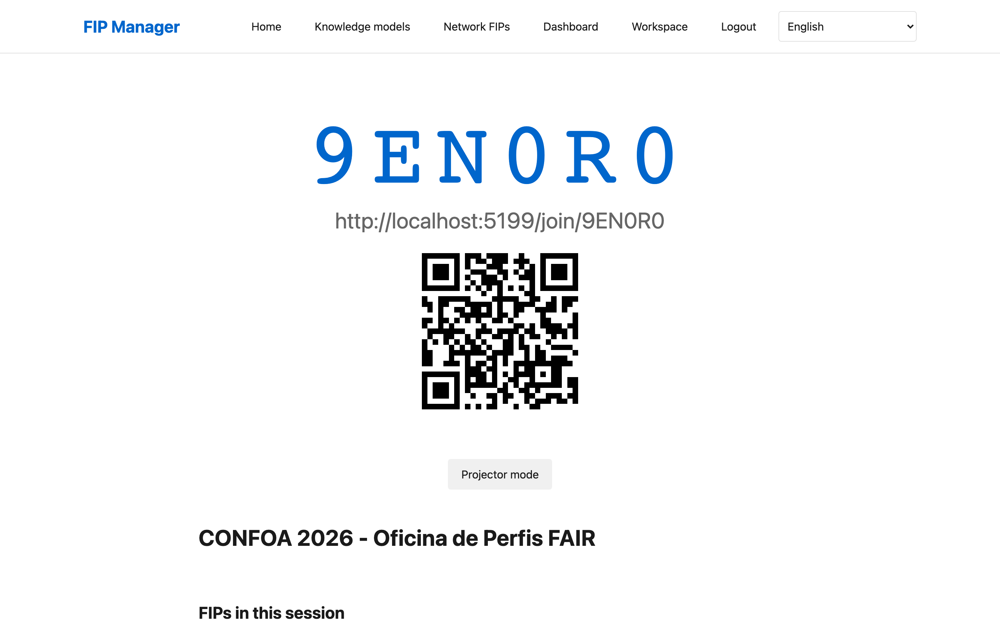

- **Código de acceso y código QR** — lo que usan los participantes para entrar. El **modo proyector** elimina
  el cromado de la página para que el código y el QR sean legibles desde el fondo de la sala.
- **Una lista en vivo de FIP** a medida que se crean, actualizándose sin actualizar.
- **Exportaciones** de cada FIP en la sesión, juntos.
- **La matriz de comparación** (vea [§8](#8-comparar-los-resultados)).
- **Cierre** la sesión para evitar que nuevos participantes se unan, y **elimínela** cuando termine.

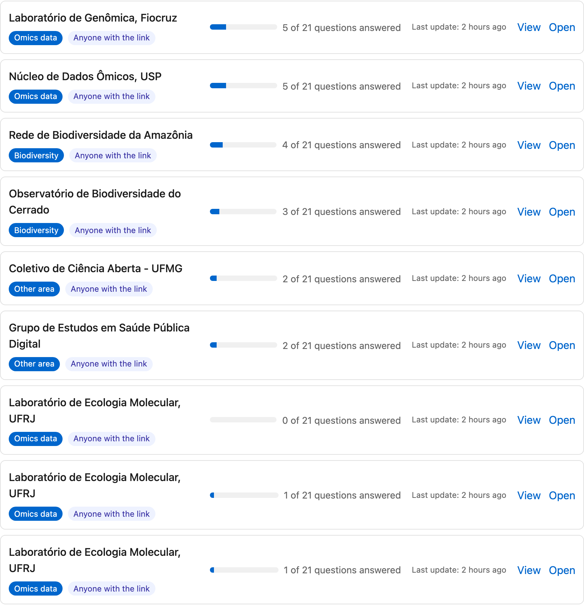

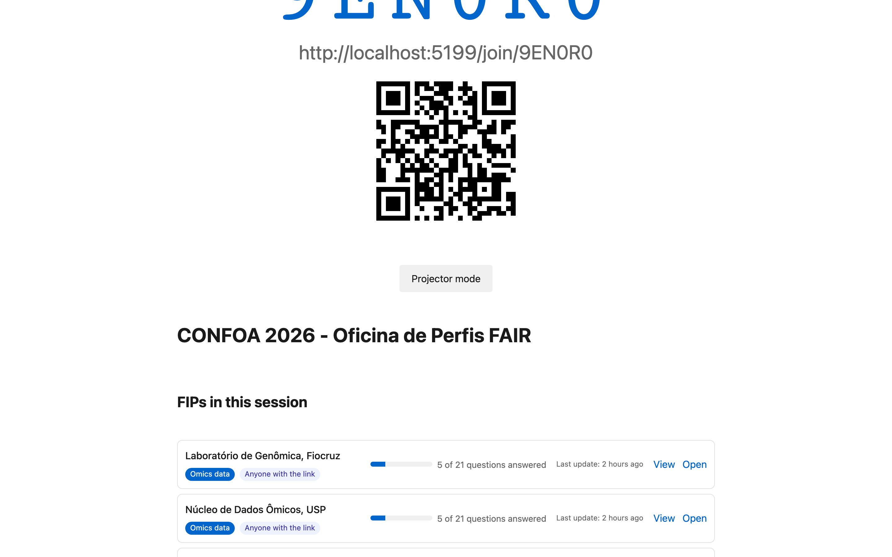

> **Qué hace la eliminación.** Eliminar una sesión se propaga a los FIP anónimos creados en ella. Los FIP
> que los participantes reclamaron en sus propias cuentas se desvinculan y sobreviven. Cierre una sesión
> cuando simplemente desee que deje de aceptar accesos.

Algunas cosas que vale la pena saber antes de que la sala se llene:

- **Imprima una alternativa en papel.** Cada modelo publicado tiene un cuestionario imprimeible en
  `/knowledge-models/{id}/{version}/print`, con filas para rellenar. Lleve copias.
- **Los participantes no necesitan cuentas.** Requerir registro en la puerta es la forma más fácil de
  perder diez minutos de un ejercicio de treinta minutos.
- **El enlace de acceso es `{FIPM_BASE_URL}/join/{joinCode}`.** Si el código QR falla, los participantes pueden
  escribir el código en la página de inicio.

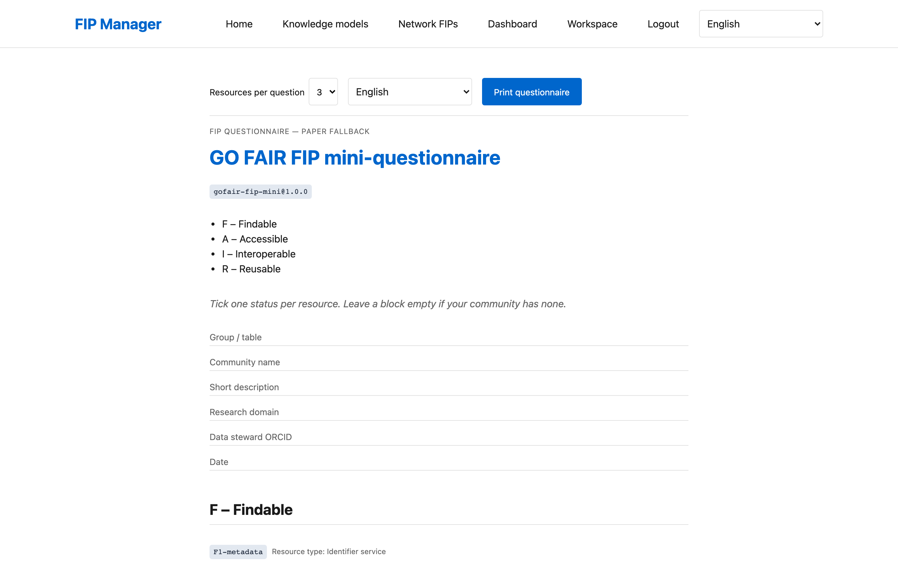

---

## 8. Comparar los resultados

La **matriz de comparación** en `/sessions/{id}/matrix` es la vista para poner en el proyector cuando
el rellenado se detiene. Muestra principio × grupo, se actualiza en vivo a medida que los FIP cambian,
puede filtrarse para mostrar solo las declaraciones actuales, y se imprime. La convergencia por
principio muestra dónde la sala estuvo de acuerdo y dónde no — lo que suele ser la parte más
productiva de la discusión.

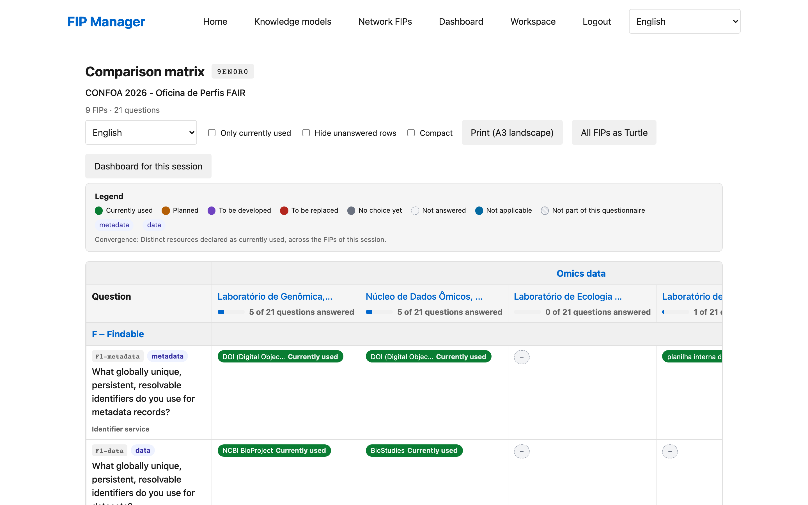

Para análisis más allá de una sesión, use el [panel](#13-el-panel).

---

## 9. El catálogo FER

Las respuestas nombran **Recursos Habilitadores FAIR (FER)**. El catálogo tiene dos niveles:

- **Catálogo del sistema** — global, curado, compartido entre modelos. Bajo `data/`.
- **FER integrados** — definidos dentro de un solo modelo de conocimiento, para recursos específicos de él.

Cuando los participantes escriben un recurso que no está en el catálogo, se convierte en un FER **pendiente**.
En la página de administración puede:

- **Promover** un FER pendiente al catálogo del sistema, y
- **Fusionar** dos FER, reemplazando cada uso de uno con el otro — la solución para la misma cosa
  escrita de tres formas diferentes.

> **Cure después del evento, no durante.** Promover es un juicio sobre si algo es un recurso real
> con nombre, y fusionar reescribe las respuestas existentes. Ninguno se beneficia de hacerse con
> prisa con una sala esperando.

---

## 10. Administración de usuarios

La página de administración (`/admin`, solo administradores) lista usuarios con su nombre, correo,
rol, fecha de creación y cuántos FIP, sesiones y modelos poseen, y le permite buscar.

**Restablecer contraseña** emite una contraseña temporal, mostrada **una vez** — cópiela antes de
cerrar el diálogo. El usuario está obligado a cambiarla en el próximo inicio de sesión.

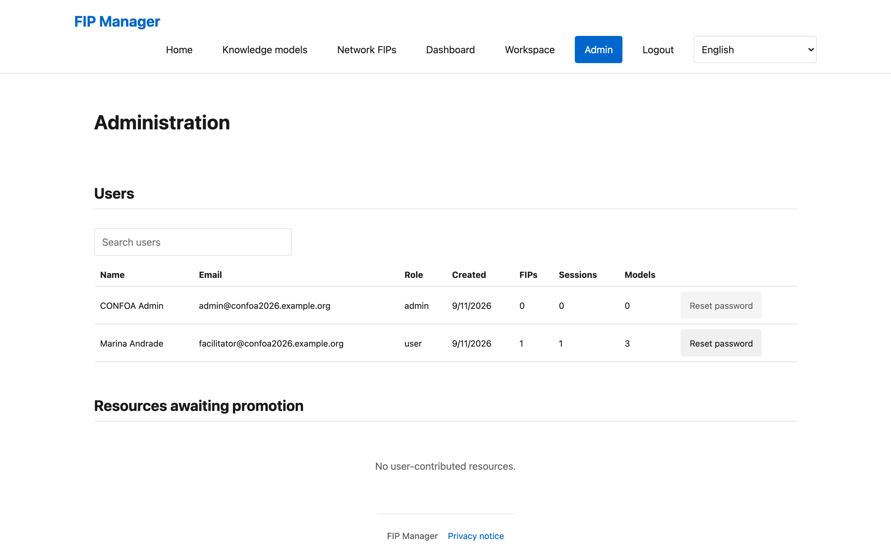

También en esta página: promover/fusionar FER pendientes, y borradores de modelos de conocimiento
sin dueño (por ejemplo, los escritos por el script de importación), que los administradores pueden
editar y publicar.

---

## 11. Exportaciones y RDF

| Alcance | Formatos |
|---|---|
| Un FIP | JSON, CSV, Turtle, JSON-LD |
| Una sesión completa | JSON, CSV, Turtle |
| Un cuestionario | Turtle, JSON-LD y una versión imprimeible en papel |
| Una vista del panel | CSV |

RDF sigue la **ontología FIP** (`https://w3id.org/fair/fip/terms/`), por lo que las exportaciones son
utilizables por cualquier herramienta FAIR, no solo esta instancia. Las declaraciones llevan su
estado, por lo que "planificado" y "en uso actualmente" se mantienen distinguibles, y `migratedFrom`
registra de dónde proviene una respuesta migrada.

> **Pendiente:** el vocabulario de extensión `https://w3id.org/fipm/ns#` utilizado por la exportación
> **aún no está registrado** en w3id, y la página de términos aún no está publicada. Las exportaciones
> son RDF válido y estables en forma, pero ese espacio de nombres aún no resuelve.

Las exportaciones CSV llevan una protección contra inyección de fórmulas, por lo que son seguras de
abrir en una hoja de cálculo.

---

## 12. Mover FIP a una nueva versión de cuestionario

Cuando publica una nueva versión de un modelo, los FIP existentes permanecen en la antigua.
`/fips/{id}/migrate` lleva un FIP a la nueva versión, mostrando un diff de pregunta antigua → nueva
con lo que se mapeó, añadió y eliminó, y marca dónde el texto o el tipo de FER de una pregunta
cambió. Cuando una pregunta antigua se convirtió en varias nuevas, elige cómo dividir sus
declaraciones. Las exportaciones registran `migratedFrom`.

**Los FIP creados dentro de una sesión están anclados** a la versión de cuestionario de esa sesión y no
pueden migrarse fuera de ella — el registro de lo que un evento realmente usó se mantiene intacto.
La página de migración muestra un aviso en lugar de ofrecer el movimiento. Los FIP independientes, y
los FIP que ya no están adjuntos a una sesión, se migran libremente.

---

## 13. El panel

El panel analiza una **población** de FIP — una sesión, los FIP públicos de esta instancia, o FIP
ingeridos desde la red de nanopublicaciones — a través de cinco vistas:

| Vista | Respuestas |
|---|---|
| **Cobertura** | Qué principios FAIR esta población aborda realmente |
| **Adopción** | Qué recursos se usan, y con qué amplitud |
| **Similitud** | Qué comunidades se parecen entre sí; agrupaciones y vecinos |
| **Brechas** | Qué preguntas quedan sin responder |
| **Evolución** | Cómo cambia el panorama con el tiempo |

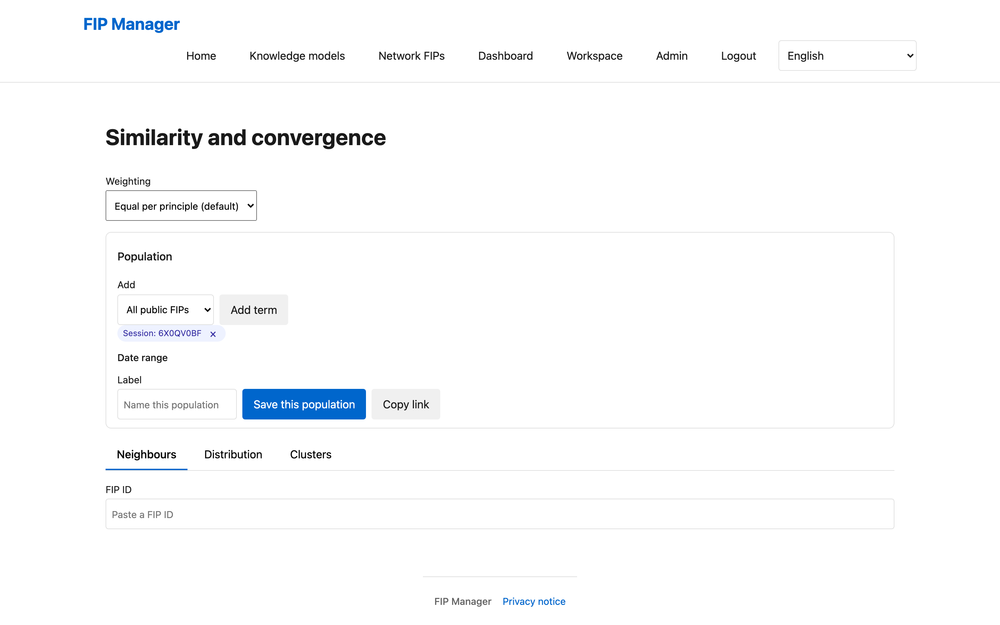

Cada vista se exporta a CSV y tiene una hoja de estilos para impresión.

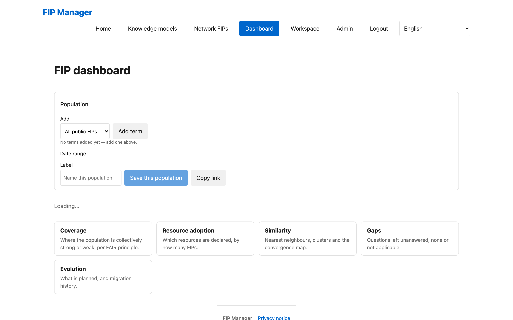

Dos comportamientos que debe entender antes de mostrarlo a alguien:

- **k-anonimato.** Cuando una población es más pequeña que `FIPM_DASHBOARD_MIN_POPULATION` *y*
  contiene FIP que el espectador no puede abrir individualmente, los recuentos se **retienen** en lugar
  de mostrarse. Un recuento retenido se muestra como tal — no se muestra como cero. Ver su propia
  sesión está deliberadamente exento, por lo que un facilitador siempre puede leer su propia sala pequeña.
- **Modo degradado.** Si la proyección subyacente está desactualizada o falta, el panel lo indica en
  lugar de mostrar números que no puede respaldar. Las instancias pequeñas vuelven a calcular en el
  momento; las más grandes muestran una banda y la antigüedad de los datos.

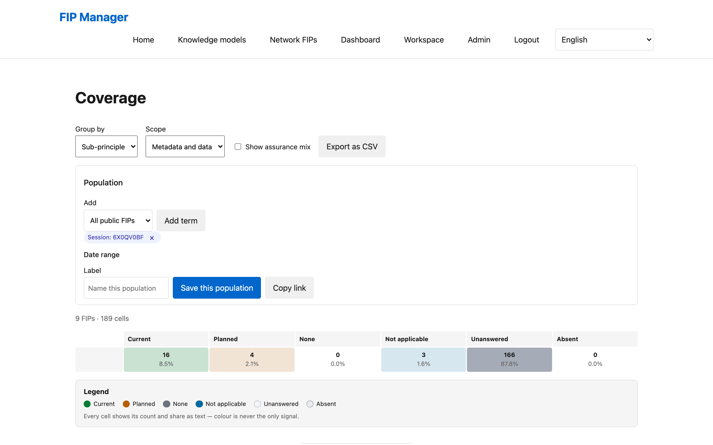

Manténgalo actualizado con `refresh-dashboard`, y vuelva a construir la proyección con
`backfill-declarations` después de una importación masiva. `check-declarations` verifica que la
proyección aún coincida con los FIP.

---

## 14. La red de nanopublicaciones

Con `FIPM_NETWORK_ENABLED=true`, `/network` navega y busca comunidades FIP publicadas como
nanopublicaciones, mapea cualquier FIP de la red a las preguntas de esta instancia (listando las
preguntas que no puede mapear), y ofrece **"Usar como punto de partida"** para prerellenar un nuevo FIP,
importando recursos desconocidos como FER de catálogo marcados con origen `network`.

Cada FIP también puede descargarse como un **zip de nanopublicaciones sin firmar** — comunidad, una
por declaración, índice y FIP — en la forma del Asistente de FIP, con un manifiesto de lo que aún
requiere la publicación.

> **Esta instancia no publica en la red ni mantiene claves.** Firmar requiere un ORCID, una clave RSA,
> una declaración de clave y `nanopub-py` o `nanopub-java`. El lado de lectura y el lado de
> preparación para exportación están completos; el lado de publicación deliberadamente no.

`ingest-network-fips` incorpora los FIP de la red como filas sombra de solo lectura para el análisis del
panel. Son hechos ingeridos, nunca recuperaciones en vivo — el panel nunca invoca la red mientras se
renderiza.

---

## 15. Operar la instancia

**Haga copia de seguridad de la base de datos.** `scripts/backup-db.sh` hace una copia consistente
del archivo SQLite. Todo lo que un participante produjo está allí; `data/` contiene solo el contenido
que usted autoró. Ejecútelo antes de cualquier migración o importación masiva, y en un calendario
una vez que esté en vivo.

**Retención.** Los FIP independientes llevan una promesa de retención de doce meses en el aviso de
privacidad. Nada la hace cumplir automáticamente — no se incluye ningún programador con la herramienta.
Ejecute `purge-standalone-fips` mensualmente, o la promesa en `/privacy` no se está cumpliendo.

**Limitación de velocidad** protege el inicio de sesión, la retroalimentación, la creación de FIP
independientes y las poblaciones del panel guardadas. Depende de ver las IP reales de los clientes —
vea `FIPM_TRUST_PROXY` en [§3](#3-implementar-una-instancia).

**Capacidad.** Probado bajo carga con 40 y 80 participantes concurrentes simulados sin errores y
p95 por debajo de 10 ms en escrituras, con SQLite en modo WAL. Una sala de conferencia no es un
problema de escala; `scripts/load-test.py` vuelve a ejecutar la verificación.

**Respaldo sin conexión.** Todo el stack se ejecuta desde un portátil y un punto de acceso. Pruebe
esto antes del evento, con un teléfono real uniéndose a un punto de acceso real — es el plan de
contingencia más probable que se necesite y menos probable que se haya probado.

---

## 16. Referencia de línea de comandos

Ejecute como `uv run python -m fipm <comando>` desde `backend/`.

| Comando | Argumentos clave | Realiza |
|---|---|---|
| `import-data` | `--force` | Carga los modelos de conocimiento y el catálogo FER de `data/` en la base de datos. Idempotente; `--force` sobrescribe los modelos cambiados |
| `create-admin` | `--email`, `--password` | Crea un usuario como administrador, o promueve uno existente |
| `serve` | `--host`, `--port`, `--reload` | Ejecuta el servidor de API |
| `purge-standalone-fips` | `--older-than-days` (365), `--dry-run` | Elimina FIP independientes sin tocar durante N días. **Siempre ejecute dry-run primero** |
| `backfill-declarations` | `--batch`, `--questionnaire`, `--since`, `--only-stale`, `--dry-run`, `--progress` | Reconstruye la proyección del panel. Idempotente y por lotes |
| `check-declarations` | `--sample`, `--all`, `--fix`, `--json` | Verifica que la proyección coincida con los FIP |
| `refresh-dashboard` | `--population`, `--all-saved`, `--views`, `--force`, `--json` | Recalcula instantáneas en caché del panel |
| `ingest-network-fips` | `--limit`, `--community`, `--since`, `--json` | Trae FIP de la red como filas sombra de solo lectura |

---

## 17. Solución de problemas

| Síntoma | Causa y solución |
|---|---|
| **Se niega a iniciar en producción** | Los secretos de desarrollo aún están en su lugar. Establezca un `FIPM_SECRET_KEY` real. |
| **Los enlaces de acceso o códigos QR apuntan a localhost** | `FIPM_BASE_URL` no está establecido o es incorrecto. También está integrado en los identificadores de FIP — solúcione antes de que existan datos reales. |
| **Los participantes no pueden iniciar sesión, pero deberían poder** | Verifique `FIPM_REGISTRATION_OPEN`, y `FIPM_REQUIRE_EMAIL_VERIFICATION` (que necesita un backend de correo funcional — el valor por defecto solo registra). |
| **No llega ningún correo** | `FIPM_MAIL_BACKEND` por defecto es `console`. Establézcalo a `smtp` y configure la configuración SMTP. |
| **La limitación de velocidad bloquea o ignora a las personas equivocadas** | Las IP de los clientes son incorrectas. Establezca `FIPM_TRUST_PROXY=true` solo detrás de un proxy que haya verificado. |
| **Las preguntas o traducciones no aparecen después de editar `data/`** | Ejecute `import-data` (`--force` si el modelo cambió). |
| **El panel muestra una banda de datos desactualizados** | Ejecute `backfill-declarations`, luego `refresh-dashboard`. |
| **El panel retiene recuentos** | k-anonimato. Esperado para poblaciones pequeñas que contienen FIP que el espectador no puede abrir; no es un error. |
| **Un FIP no puede migrarse** | Su versión de modelo está anclada. |
| **Un recurso aparece tres veces con nombres diferentes** | Fusiónelos en la página de administración. |
| **`/network` está vacío o desactivado** | `FIPM_NETWORK_ENABLED`, o el servicio de consulta ascendente no es alcanzable. El resto de la herramienta no se ve afectado. |

---

## Atribución

Contenido del cuestionario: FIP mini-questionnaire v2.0.0 © 2023 Erik Schultes, Barbara Magagna,
Jacintha Schultes / GO FAIR Foundation, CC BY-SA 4.0. Las listas de selección por área adaptadas
de "PERFIS DE IMPLEMENTAÇÃO FAIR 2" (autor por confirmar), utilizadas bajo los mismos términos CC BY-SA 4.0.
