# Preenchendo um FIP — Guia para Participantes

**Gerenciador de FIP** ajuda uma comunidade de pesquisa a registrar, de forma precisa e comparável, quais
técnicas ela realmente utiliza para tornar seus dados e metadados **L**ocalizáveis, **A**cessíveis,
**I**nteroperáveis e **R**eutilizáveis. O resultado é um **Perfil de Implementação FAIR (FIP)**:
21 perguntas curtas, uma escolha tecnológica por pergunta, exportável como JSON, CSV e RDF.

Este guia é para a pessoa que **preenche** um FIP — em um workshop ou por conta própria. Pressupõe
que não há conhecimento técnico prévio nem familiaridade com FAIR além das quatro letras.

> **Não é necessário instalar nada.** O Gerenciador de FIP funciona no navegador do seu celular ou computador. Você não
> precisa de uma conta para preencher um FIP, e não é obrigatório terminá-lo em uma só sessão.

> **Seu trabalho é salvo automaticamente.** Não há um botão "enviar". Cada alteração é armazenada um momento
> após você fazê-la — observe o indicador *Salvo*. Fechar a aba não apaga seu trabalho,
> desde que você mantenha o link (veja [§6](#6-voltando-depois-e-em-outro-dispositivo)).

Se você está no workshop CONFOA e prefere uma única página impressa em vez deste guia, use
[`workshop/participant-handout.md`](workshop/participant-handout.md), que aborda o mesmo
conteúdo em inglês e pt-PT em uma folha.

---

## Sumário

1. [O que você está descrevendo (conceitos-chave)](#1-o-que-você-está-descrevendo-conceitos-chave)
2. [Três maneiras de começar](#2-três-maneiras-de-começar)
3. [O editor de relance](#3-o-editor-de-relance)
4. [Passo a passo: preencha seu primeiro FIP](#4-passo-a-passo-preencha-seu-primeiro-fip)
   - [Passo 1 — Escolha sua área](#passo-1--escolha-sua-área)
   - [Passo 2 — Dê um nome à sua comunidade](#passo-2--dê-um-nome-à-sua-comunidade)
   - [Passo 3 — Leia a pergunta](#passo-3--leia-a-pergunta)
   - [Passo 4 — Marque uma opção sugerida](#passo-4--marque-uma-opção-sugerida)
   - [Passo 5 — Responda com suas próprias palavras](#passo-5--responda-com-suas-próprias-palavras)
   - [Passo 6 — Quando a pergunta não se aplica](#passo-6--quando-a-pergunta-não-se-aplica)
   - [Passo 7 — Quando está planejado em vez de em uso](#passo-7--quando-está-planejado-em-vez-de-em-uso)
   - [Passo 8 — Adicione mais de uma resposta](#passo-8--adicione-mais-de-uma-resposta)
   - [Passo 9 — Acompanhe seu progresso](#passo-9--acompanhe-seu-progresso)
   - [Passo 10 — Compartilhe seu FIP](#passo-10--compartilhe-seu-fip)
5. [Os cinco tipos de resposta](#5-os-cinco-tipos-de-resposta)
6. [Voltando depois e em outro dispositivo](#6-voltando-depois-e-em-outro-dispositivo)
7. [Criando uma conta (opcional)](#7-criando-uma-conta-opcional)
8. [Escolhendo seu idioma](#8-escolhendo-seu-idioma)
9. [Baixando e compartilhando seu FIP](#9-baixando-e-compartilhando-seu-fip)
10. [Solução de problemas](#10-solução-de-problemas)
11. [Atribuição](#11-atribuição)

---

## 1. O que você está descrevendo (conceitos-chave)

Você não está sendo perguntado sobre o que você *deveria* fazer, ou o que diz a política da sua instituição. Você está
sendo perguntado sobre o que sua comunidade **realmente utiliza hoje** — e, quando relevante, o que planeja
utilizar. Um "ainda não decidimos" honesto é uma resposta melhor do que uma aspiração.

| Termo | O que significa para você |
|---|---|
| **FIP** | O perfil completo que você está preenchendo — as respostas da sua comunidade a todas as 21 perguntas. |
| **FER** (FAIR Enabling Resource) | A tecnologia, serviço ou padrão específico que você nomeia como resposta — a coisa que faz o trabalho de viabilizar FAIR. **DOI** é um FER; **Dublin Core**, **OWL** e **CC BY 4.0** também são. |
| **Comunidade** | De quem é a prática que você está descrevendo — um grupo de pesquisa, um projeto, um consórcio, um instituto. Você dá um nome a ela no início. |
| **Pergunta** | Uma de 21, agrupadas pelas quatro letras FAIR. Cada uma pede um tipo de recurso: "quais identificadores para seus dados?", "qual licença para seus metadados?" |
| **Declaração** | Uma única resposta a uma pergunta: *este* recurso, com um status, opcionalmente com uma nota. Uma pergunta pode conter várias declarações. |
| **Status** | Se o recurso está em uso agora, planejado, em desenvolvimento ou será substituído. |
| **Área** | Um tipo de questionário específico para um domínio de pesquisa (ômica, biodiversidade, agricultura, saúde pública, enfermagem…). Cada área sugere uma lista curta de opções ajustadas para aquele campo. |

> **Por que "uma tecnologia por pergunta" é importante.** Um FIP é útil porque é comparável.
> Quando cinquenta comunidades nomeiam seus esquemas de identificadores reais, você vê convergência e
> divergência de relance — o que é impossível com prosa de política em formato livre.

---

## 2. Três maneiras de começar

| Você está… | Faça isto | Conta necessária? |
|---|---|---|
| Em um workshop, com um código ou QR na tela | Escaneie o QR, ou abra o site e digite o **código de acesso** na página inicial | Não |
| Trabalhando por conta própria, agora | Abra o site e escolha **Começar um FIP** (ou vá para `/fips/new`), depois selecione um questionário | Não |
| Voltando ao trabalho que começou | Use seu **link de edição**, ou a lista **FIPs neste dispositivo** na página inicial | Não |

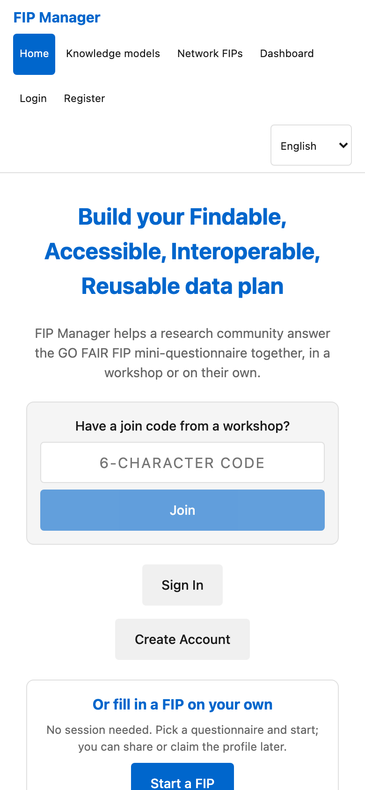

As três opções levam você ao mesmo editor. Uma conta nunca é obrigatória para preencher um FIP —
ela só se torna útil depois, se você quiser todos os seus FIPs reunidos em uma única área de trabalho
([§7](#7-criando-uma-conta-opcional)).

> **Entrar em uma sessão vs. começar sozinho.** Uma *sessão* é um exercício em grupo facilitado: o
> facilitador vê os FIPs enquanto são preenchidos e pode exportá-los juntos. Um FIP *independente*
> pertence apenas a você. As perguntas e o editor são idênticos.

---

## 3. O editor de relance

O editor de FIP tem quatro partes, de cima para baixo:

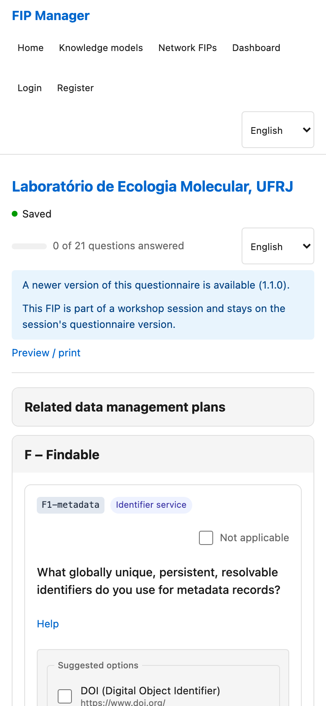

- **O cabeçalho da comunidade** — o nome da comunidade que você está descrevendo, mais detalhes opcionais.
  Você pode editar isso a qualquer momento; não fica bloqueado após a criação.
- **Uma barra de progresso** — quantas das perguntas têm pelo menos uma resposta. É um guia, não
  um requisito: uma pergunta não respondida é um estado legítimo.
- **Quatro seções recolhíveis** — **Localizável**, **Acessível**, **Interoperável** e **Reutilizável**. A seção **Localizável** está aberta quando
  você chega; toque em um título para abrir ou fechar uma seção. Trabalhe na ordem que preferir.
- **A linha de ações** — compartilhamento, download e (se você estiver conectado) controles de visibilidade.

Cada pergunta dentro de uma seção é um card que mostra o texto da pergunta, um texto curto de **Ajuda** que
você pode expandir, um alternador **Não se aplica**, e a área de resposta.

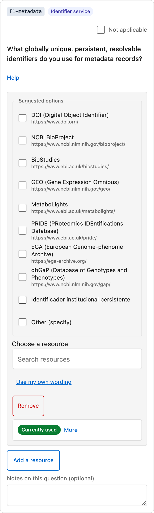

> **No celular**, seções e cards de perguntas são empilhados verticalmente e tudo é acessível por
> rolagem — não há uma versão móvel separada para procurar.

---

## 4. Passo a passo: preencha seu primeiro FIP

### Passo 1 — Escolha sua área

Se o facilitador ofereceu vários questionários de área, você escolhe um ao entrar. Escolha a
área mais próxima ao trabalho do seu grupo. Se nenhuma se adequar, escolha **"Outra área"** — você recebe
a lista genérica de 21 perguntas com texto livre disponível em toda parte.

A área determina **quais opções são sugeridas**, não quais perguntas são feitas. Todas as áreas
fazem as mesmas 21 perguntas.

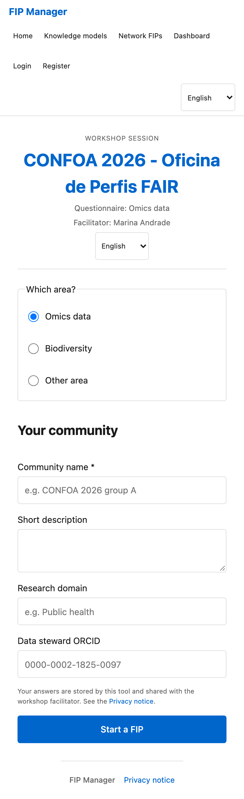

> **Esta escolha é feita uma vez, ao entrar.** Se você escolheu a área errada, a correção mais rápida em um
> workshop é começar um novo FIP e escolher novamente — peça ao facilitador, que também pode remover
> o abandonado.

### Passo 2 — Dê um nome à sua comunidade

Dê à comunidade um nome que as pessoas reconheceriam — "Laboratório de Genômica, Fiocruz" em vez de
"nosso grupo". Esse nome aparece na matriz de comparação que a sala vê em conjunto, e em
todas as exportações.

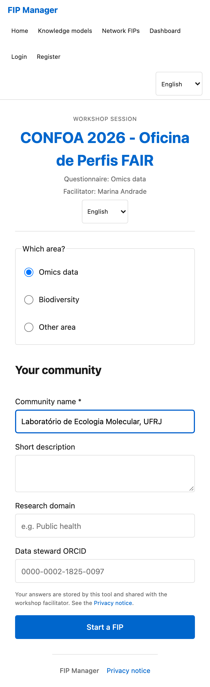

### Passo 3 — Leia a pergunta

Cada pergunta nomeia um tipo de recurso que viabiliza FAIR. Se a redação não for familiar, expanda
o texto de **Ajuda**: ele explica que tipo de coisa está sendo perguntada, e geralmente dá um
exemplo.

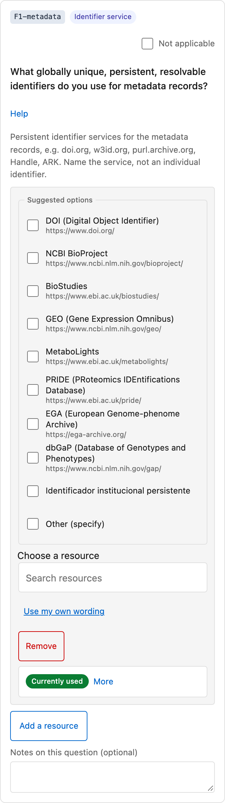

> **Se você realmente não souber**, deixe a pergunta em branco e siga em frente. Voltar a ela
> depois de ver as outras perguntas muitas vezes é mais fácil, e uma pergunta em branco é honesta.

### Passo 4 — Marque uma opção sugerida

A maioria das perguntas mostra uma lista curta de opções sugeridas. **Marcar uma registra que sua
comunidade a utiliza hoje** — essa é toda a ação, sem mais etapas.

As opções sugeridas vêm em dois tipos, e ambos são respostas igualmente válidas:

- **Recursos de catálogo** — FERs reconhecidos e nomeados (DOI, ORCID, Dublin Core…). Esses são os
  que permitem uma comparação clara entre comunidades.
- **Frases sugeridas** — formulações descritivas para práticas que não são um produto nomeado
  ("apenas texto não estruturado", "conta do repositório"). Estas registram a realidade onde nenhum
  recurso padrão existe.

Se a lista não mostrar o que você precisa, use a busca do catálogo para procurar um recurso pelo
nome, ou escreva sua própria resposta — próximo passo.

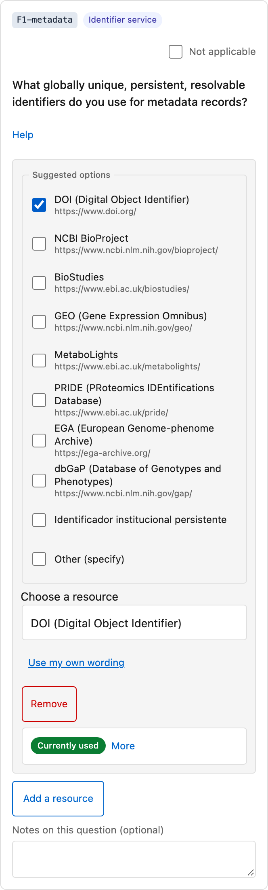

### Passo 5 — Responda com suas próprias palavras

No final da lista de opções está **"Outro (especificar)"**. Marque-a para abrir uma caixa de texto, digite sua própria redação e pressione Enter ou
toque no botão de adicionar. A linha de declaração também tem um botão **"Usar minhas próprias palavras"**
que alterna o seletor de recurso da busca no catálogo para texto livre para naquela resposta.

Uma resposta em texto livre é **tão válida** quanto uma listada. Use-a para ferramentas locais, sistemas
internos e práticas informais — são exatamente as coisas que uma lista fixa não pode antecipar,
e omiti-las representaria mal sua comunidade.

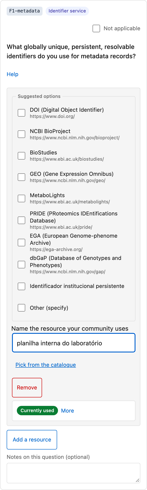

### Passo 6 — Quando a pergunta não se aplica

Algumas perguntas realmente não se aplicam a uma determinada comunidade. Alterne **"Não se aplica"**
na própria pergunta. A ferramenta pede que você confirme, porque marcar uma pergunta como não aplicável
remove quaisquer recursos já registrados nela. A caixa de comentário então pergunta *por que* ela não se aplica —
uma linha curta é suficiente, e vale a pena escrevê-la, porque "não se aplica" e "não respondido"
têm significados muito diferentes para quem lê seu FIP depois.

> **"Não se aplica" não é uma forma de pular.** Use-o quando a pergunta for realmente irrelevante para sua
> comunidade — não quando você estiver incerto, e não quando a resposta for simplesmente "nenhum ainda". Para "ainda
> não decidimos", deixe a pergunta em branco em vez disso.

### Passo 7 — Quando está planejado em vez de em uso

Marcar uma opção registra **Em uso**. Quando essa não for a descrição correta, toque em
**"Mais"** na resposta para abrir o controle de status completo:

| Status | Use-o quando |
|---|---|
| **Em uso** | Em uso hoje. É isso que marcar uma opção registra. |
| **Planejado** | Decidido, ainda não em uso. |
| **Em desenvolvimento (planejado)** | Sendo construído ou adotado agora. |
| **Substituição planejada** | Você o usa hoje, mas ele será substituído. Nomeie também o recurso sucessor. |
| **Nenhum** | Você quer registrar explicitamente que nada foi decidido, em vez de deixar a pergunta em branco. |

O mesmo painel "Mais" contém uma **nota** opcional — uma frase de contexto — e, onde sua
instância está vinculada a uma ferramenta de plano de gestão de dados, uma forma de apontar para a seção de um DMP
que evidencia esta resposta.

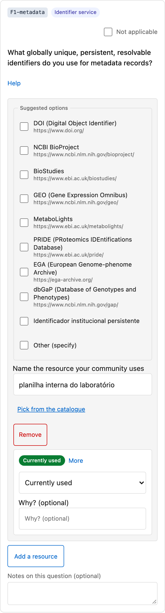

### Passo 8 — Adicione mais de uma resposta

Muitas perguntas aceitam várias respostas: dois esquemas de identificadores, um vocabulário atual e sua
substituição planejada. Use **"Adicionar um recurso"** para registrar cada uma separadamente, com seu próprio
status e nota, em vez de colocá-las todas em uma única caixa de texto livre. Declarações separadas
permanecem comparáveis; uma frase listando três coisas não.

### Passo 9 — Acompanhe seu progresso

A barra de progresso conta perguntas com pelo menos uma resposta. Não há mínimo nem validação —
um FIP com doze respostas honestas é mais útil do que um com 21 chutes.

O salvamento acontece sozinho, um momento após você parar de digitar. O indicador lê **"Salvo"** com um
horário, e **"Alterações não salvas"** enquanto uma alteração ainda está pendente.
Se você estiver prestes a fechar o laptop, dê uma olhada naquele indicador primeiro.

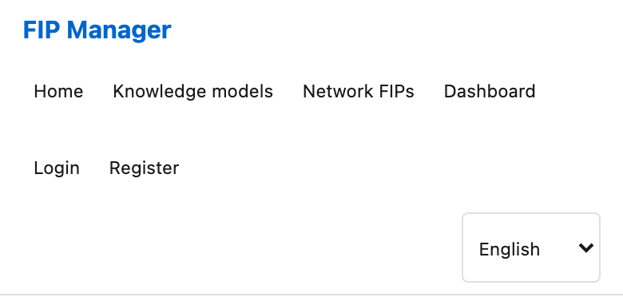

### Passo 10 — Compartilhe seu FIP

Abra o painel **Compartilhar**. Ele oferece duas coisas diferentes:

- **O link do FIP** — um URL permanente e **somente leitura** para o seu FIP, mais um código QR. Seguro para enviar
  a qualquer pessoa; elas podem ler, mas não alterar.
- **O link de edição** — um URL que **concede permissão de edição**. Qualquer pessoa que o tiver pode alterar seu FIP,
  então compartilhe-o apenas dentro do seu grupo.

Guarde o link do FIP. Ele continua funcionando após o workshop.

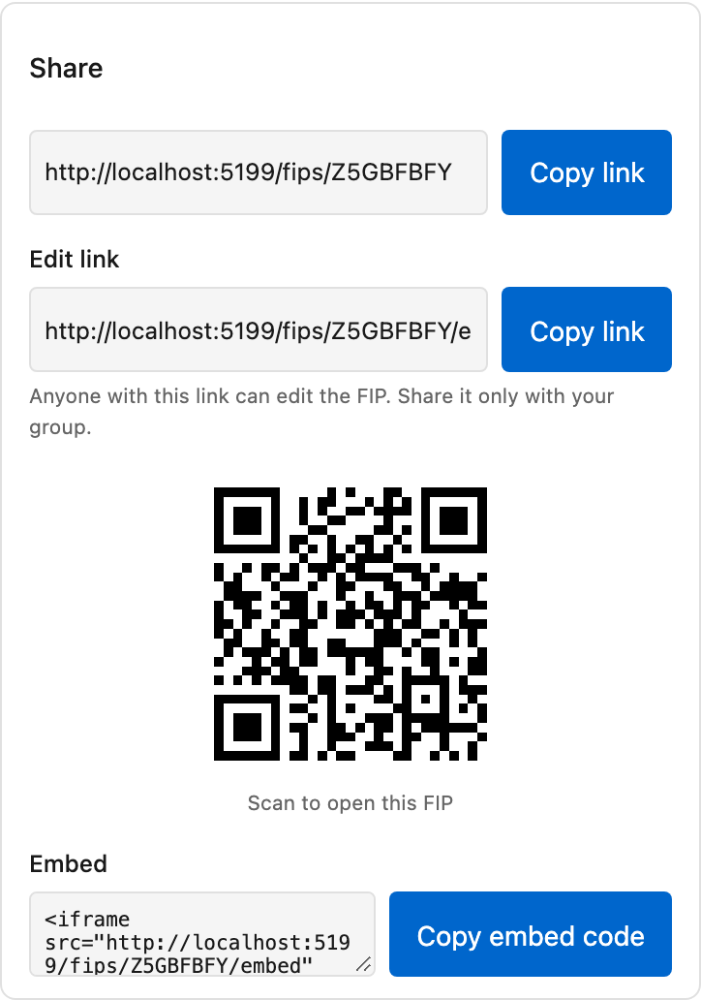

---

## 5. Os cinco tipos de resposta

| Resposta | Como | O que ela registra |
|---|---|---|
| **Marcar uma opção** | Toque em uma opção sugerida | Sua comunidade a utiliza hoje |
| **Buscar no catálogo** | Busque pelo nome no seletor | O mesmo, para um recurso não nas sugestões |
| **"Outro (especificar)"** | Marque-a, digite, pressione Enter | Suas próprias palavras — igualmente válido |
| **"Não se aplica"** | Alterne na pergunta, confirme | A pergunta é irrelevante para sua comunidade |
| **Deixar em branco** | Siga em frente | Ainda não decidido — uma resposta honesta, não uma falha |

---

## 6. Voltando depois e em outro dispositivo

Seu FIP **não** está vinculado ao dispositivo que o criou.

- **Mesmo dispositivo** — a página inicial lista **FIPs neste dispositivo**. Toque no seu para reabri-lo.
- **Outro celular ou laptop** — abra o painel **Compartilhar**, copie o **link de edição** e abra esse
  link no outro dispositivo. Essa é a forma recomendada de alternar entre um celular e um laptop, ou
  de passar o FIP a um colega que continuará.
- **Perdeu o link completamente** — se você o preencheu durante uma sessão facilitada, o facilitador
  ainda pode ver o FIP e recuperar seu link. Se era independente e a lista do dispositivo sumiu,
  ele não pode ser recuperado — o que é a razão mais forte para criar uma conta
  ([§7](#7-criando-uma-conta-opcional)) ou para salvar o link em algum lugar.

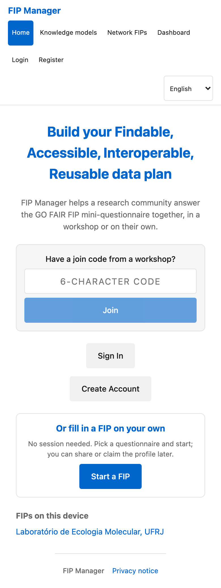

> **Trate o link de edição como uma senha.** Qualquer pessoa com ele pode editar o FIP. O link simples do FIP
> é o que deve ser compartilhado amplamente.

> **FIPs independentes não são mantidos para sempre.** Uma instância pode excluir FIPs independentes que não
> foram editados por um longo tempo (doze meses na implantação do CONFOA). FIPs reivindicados em uma conta
> não estão sujeitos a isso.

---

## 7. Criando uma conta (opcional)

Você nunca precisa de uma conta para preencher um FIP. Uma conta oferece:

- **Uma área de trabalho** listando todos os seus FIPs, sessões e modelos de conhecimento em um só lugar.
- **Reivindicação** — abra um FIP que você criou anonimamente e escolha **Salvar este FIP na minha área de trabalho**
  para movê-lo permanentemente para sua área de trabalho, para que ele não dependa mais de um link guardado
  no navegador.
- **Controle de visibilidade** — defina cada FIP como **Privado**, **Link** (qualquer pessoa com o link pode ler)
  ou **Público**.
- **Executar suas próprias sessões**, se você mais tarde facilitar um exercício você mesmo.

Você pode reivindicar um FIP a qualquer momento após criar a conta — inclusive um que você começou
em um workshop meses antes, desde que ainda tenha seu link de edição.

---

## 8. Escolhendo seu idioma

A interface está disponível em **Inglês**, **Português (Portugal)**, **Português (Brasil)**
e **Espanhol**. Use o seletor de idioma no cabeçalho; se seu navegador já estiver configurado para
um deles, o site abre nele automaticamente. As variantes de português recuam uma para a outra
antes de recuar para o inglês, para que você sempre obtenha texto em português onde qualquer
tradução para o português existir.

Alternar o idioma altera **a interface e os textos das perguntas**. Ele nunca altera ou
traduz **suas respostas** — o que você digitou permanece exatamente como você escreveu.

---

## 9. Baixando e compartilhando seu FIP

Do editor ou da visualização de somente leitura, você pode baixar seu FIP como:

| Formato | Para que serve |
|---|---|
| **JSON** | Legível por máquina, para recarregar ou processar |
| **CSV** | Uma planilha — uma linha por declaração |
| **Turtle** / **JSON-LD** | RDF seguindo a ontologia FIP, para ferramentas semânticas e publicação |

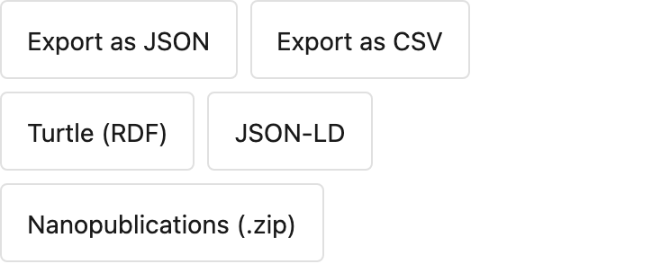

As exportações RDF são o que tornam seu FIP parte do ecossistema FAIR mais amplo em vez de uma
planilha privada. Você não precisa entendê-las para se beneficiar delas.

---

## 10. Solução de problemas

| Problema | O que fazer |
|---|---|
| **O código de acesso não é aceito** | Verifique caracteres confusos e se a sessão não foi fechada. Peça ao facilitador para ler o código novamente da tela dele. |
| **O código QR não escaneia** | Digite o código de acesso na página inicial em vez disso — é a mesma coisa. |
| **Não vejo o indicador "Salvo"** | Ele aparece um momento após você parar de digitar. Se nunca aparecer, verifique sua conexão; seu texto permanece na página até ser salvo. |
| **Minha opção não está na lista** | Busque no catálogo pelo nome, ou use **"Outro (especificar)"** e escreva você mesmo. |
| **Marquei a opção errada** | Toque nela novamente para desmarcar, ou remova a declaração da linha de resposta. |
| **Não consigo editar — tudo é somente leitura** | Você está no link simples do FIP, não no link de edição. Consiga o link de edição de quem iniciou o FIP. |
| **Escolhi a área errada** | Peça ao facilitador. A área é fixada ao entrar; começar novamente geralmente é mais rápido do que refazer. |
| **Perdi meu FIP** | Verifique **FIPs neste dispositivo** na página inicial. Em uma sessão, o facilitador pode encontrá-lo. |

---

## 11. Atribuição

Conteúdo do questionário: FIP mini-questionnaire v2.0.0 © 2023 Erik Schultes, Barbara Magagna,
Jacintha Schultes / GO FAIR Foundation, CC BY-SA 4.0. Listas de seleção por área adaptadas de "PERFIS DE
IMPLEMENTAÇÃO FAIR 2" (autor a ser confirmado), usadas sob os mesmos termos CC BY-SA 4.0.
